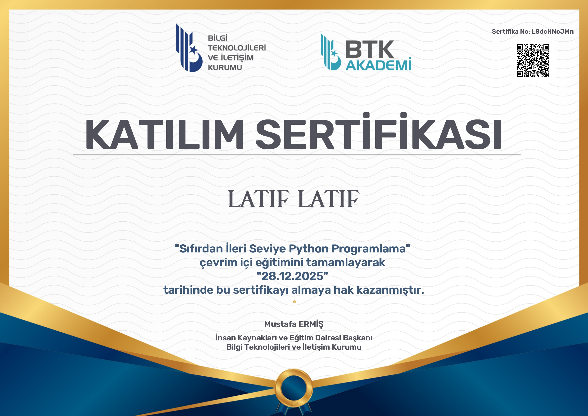
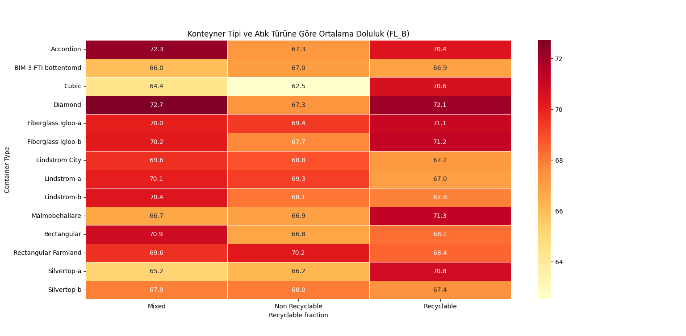
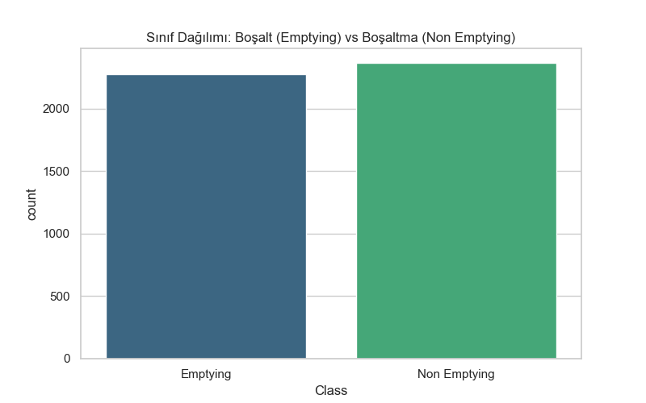
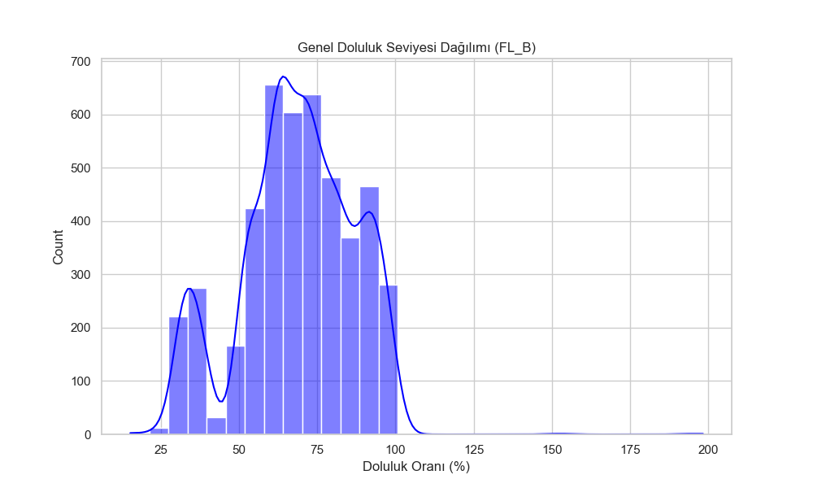
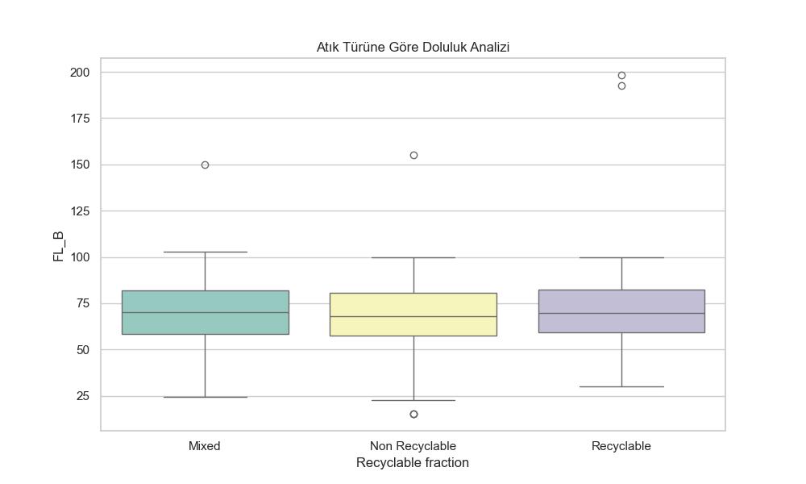
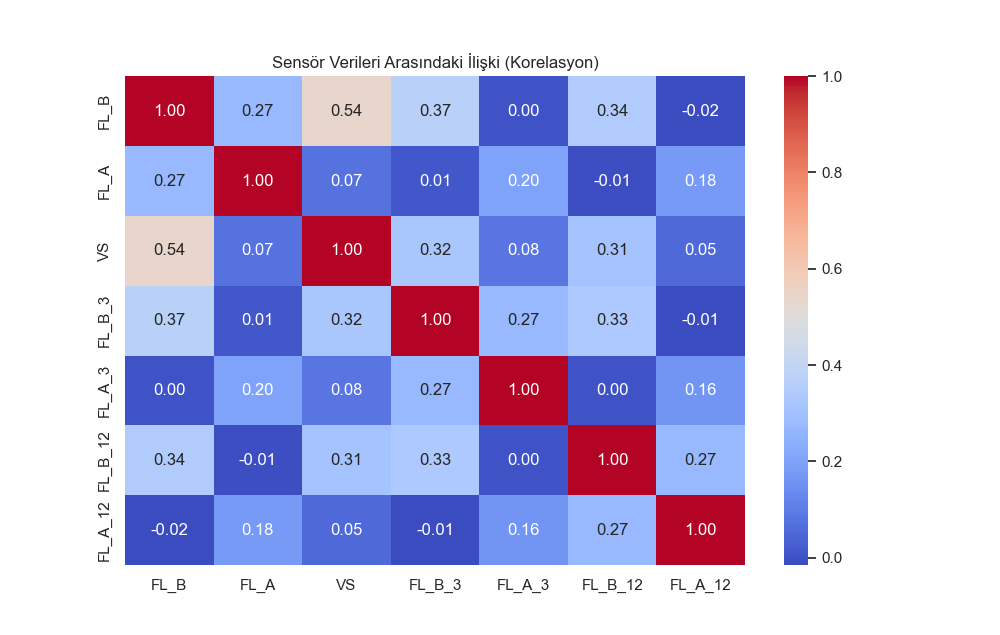

LATIF LATIF 
22360859036

---

# Sertifikalar




#  Akıllı Çöp Konteyneri: Atık Yönetimi Analizi ve Tahminlemesi


##  Proje Hakkında
Bu proje, atık yönetimi süreçlerini optimize etmek amacıyla akıllı çöp konteynerlerinden gelen IoT sensör verilerini analiz eder. Konteynerlerin doluluk oranlarını (`FL_B`), atık türlerini ve fiziksel yapılarını inceleyerek tahminler yapar ve bir konteynerin boşaltılması gerekip gerekmediğini tahminleyen bir Makine Öğrenmesi modeli geliştirir.

---

##  Veri Seti Açıklmaası
Veri seti, akıllı çöp kutularından alınan aşağıdaki öznitelikleri içerir:

Kolonlar:
* **`FL_B`**: Boşaltma işlemi öncesindeki doluluk seviyesi (Hedef analiz değişkeni).
* **`FL_A`**: Boşaltma işlemi sonrasındaki doluluk seviyesi.
* **`Container Type`**: Konteynerin fiziksel yapısı (Örn: Silvertop, Cubic).
* **`Recyclable fraction`**: Toplanan atığın türü (Cam, Karışık vb.).
* **`Class`**: Hedef Değişken (Emptying / Non Emptying).


---

## Veri Analizi
###  Pivot Analizi: Pivot Dönüşümü 
 Bu analiz, hangi konteyner tipinin hangi atık türüyle ne kadar sürede/seviyede dolduğunu ortaya koyar.Hedef değişkenimiz olan konteynerin boşaltılmalı/boşaltılmamalı 
 olayını mantığını anlamak ve hangi tür konteynerlerin hangi tür atıklarla daha çabuk dolma riskinin bulunduğunu anlamak için çok önemlidir.

**Yöntem:**
- **Satırlar:** Konteyner Tipi (Örn: Diamond, Cubic, Accordion)
- **Sütunlar:** Atık Türü (Mixed, Recyclable, Non-Recyclable)
- **Değerler:** Boşaltma Öncesi Ortalama Doluluk Seviyesi (`FL_B`)


Veri setini  anlamak için grafiksel analizler yapılmıştır:

**Sınıf Dağılımı:** "Boşalt" (Emptying) ve "Boşaltma" (Non-Emptying) etiketlerinin veri setindeki dengesi incelendi.

**Doluluk Histogramı:** `FL_B` değişkeninin dağılımı incelenerek genel doluluk eşikleri belirlendi.

**Kutu Grafikleri :**
  * *Konteyner Bazlı:* Her bir konteyner tasarımının doluluk varyansı ve aykırı değerleri tespit edildi.
  * *Atık Türü Bazlı:* Farklı atık yoğunluklarının sensör verilerine etkisi görselleştirildi.

**Korelasyon Matrisi:** Sensör okumaları (FL_B, FL_A) ve batarya/voltaj durumları arasındaki ilişkiler haritalandırıldı.

---

## Ön İşleme Adımları:
* **Eksik Veri:** Sayısal boşluklar ortalama değer ile dolduruldu.
* **Encoding:** Kategorik veriler Label Encoding ile sayısallaştırıldı.
* **Normalizasyon(Scaling):** Özellikle **KNN** algoritması için veriler `StandardScaler` ile normalize edildi.
---
##  Model Karşılaştırması ve Sonuçlar
Konteynerin boşaltılma durumunu tahmin etmek için 3 farklı Makine Öğrenmesi algoritması eğitilmiş ve karşılaştırılmıştır.


###  Performans Liderlik Tablosu

| Sıra | Model | Doğruluk (Accuracy) |
|------|-------|---------------------|
| 1 | **Random Forest** | **%96.01** |
| 2 | KNN (K En Yakın Komşu)| %90.41 | 
| 3 | Logistic Regression | %88.47 | 

Bu sonuçlar göre en başarı model Random Forest modeli olmuştur. Karmaşık ilişkileri anlamakta etkili bir modeldir,Logistic Regression modeli güzel bir baseline olmasına rağmen performansı düşük kalmıştr
KNN modeli iyi performans göstermesinde yaptığımız normalizasyon işlemi önemli rol oynamıştır.

---
## Grafikler
### Pivot analizi ısı haritası


###  Hedef Değişken Dağılımı


###  Doluluk Seviyesi Dağılımı


###  Konteyner Tipine Göre Doluluk


###  Atık Türüne Göre Doluluk 


###  Korelasyon Matrisi 


---

##  Kurulum ve Çalıştırma
1.  **Repoyu klonlayın:**
    ```bash
    git clone [[https://github.com/kullaniciadiniz/akilli-cop-analizi.git](https://github.com/kullaniciadiniz/akilli-cop-analizi.git)](https://github.com/LatifLatiff/Atik_kutusu_doluluk_seviyesi_tahmini.git)
    ```
2.  **Gerekli kütüphaneleri yükleyin:**
    ```bash
    pip install pandas numpy seaborn matplotlib scikit-learn
    ```
3.  **Analizi çalıştırın:**
    `Conteiner.py` dosyasını VS Code üzerinde açıp çalıştırın.

---

